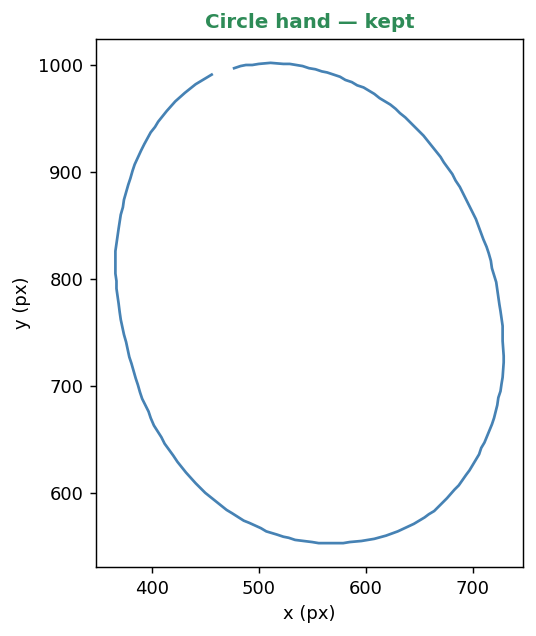
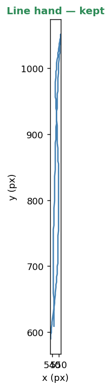
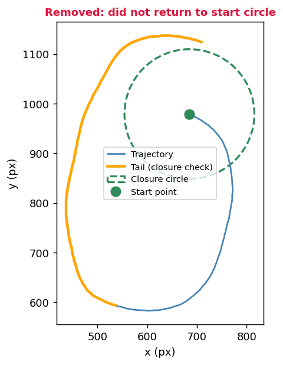
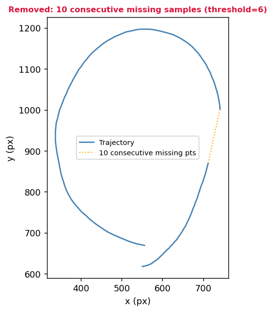
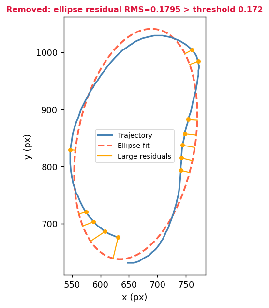
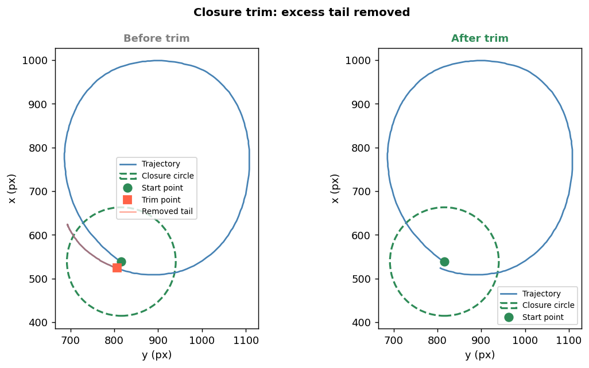

# bimanual-ellipticity-index — 両手協調課題における楕円化指数（OI）計算パイプライン

> 手動・曖昧だった楕円化指数計算を、再現性のある自動パイプラインとして再設計

**問題:** OIの計算方法は研究間で統一されておらず、自身の研究で使っていたコードは手動ステップや曖昧な軸定義に依存していた。

**解決:** PCA基準のOI計算・幾何学的サイクルフィルタリング・統一されたconfigによる全自動パイプライン。

**結果:** 明示的・調整可能なパラメータによる再現性のあるOI値とサイクル単位の品質管理を実現。両手のデータを対象に任意の両手協調データセットへ適用可能。

---

## 主な特徴

- PCAによる楕円化指数計算（軸補正不要・回転不変）
- 全軌跡へのPCAを用いたサイクル自動検出
- 幾何学的フィルタリング（楕円フィッティング残差・クロージャチェック）
- trim処理による余分な軌跡の自動除去
- configベースのパラメータ管理による再現性確保
- 全サイクル・除外ログ付きの可視化出力
- 24名×10条件・約5000サイクルを約1時間で処理

---

## 旧実装の問題と本手法

| | 旧実装 | 本手法 |
|---|---|---|
| 軸定義・OI計算 | 楕円フィッティングベース。楕円に近い軌跡には有効だが、線に近い軌跡には安定してかからないため処理の統一が困難 | PCAベース。楕円・線・その中間すべての軌跡に一貫して適用できる |
| サイクル検出 | y軸の折り返し点ベース。描画が傾いている場合、実際の折り返し点とずれが生じる | 全軌跡PCAの主軸投影ベース。折り返し点付近の速度低下（プロット間距離の減少）に最も近い基準で検出できるため、描画角度によらず高精度な切り取りが期待できる |
| 品質管理 | 目視による曖昧な除外 | 楕円フィッティング残差・クロージャチェックによる定量的除外 |
| 設定管理 | 断片的で再現困難 | 一箇所のconfigに集約 |

---

## 背景

両手協調課題では、片手で円を、もう片方の手で直線を同時に描くよう求められる。**両手協調効果**によって両方の軌跡が歪み、円を描く手の軌跡は楕円（直線寄り）に近づき、直線を描く手の軌跡も楕円に近づく。

**楕円化指数**（OI）はその軌跡がどれだけ楕円的かを定量化する指標で、0（完全な直線）から1（完全な円）の範囲をとる。両手協調の分析では、両手それぞれのOI変化が協調の程度を示す指標として用いられる。

### 開発の動機

OIは広く使われている指標だが、**計算方法が研究間で統一されていない**。直線側の手の方が変化量が大きい傾向があるため、解析の中心は線側に置かれることが多い。しかし両手で行う課題である以上、片手だけの分析では両手間の相互作用の全体像は見えない。円側の変化量が小さいとしても、そこを無視すれば研究の主張が片手落ちになる。両手を揃えて分析できるツールが必要だと感じたのが、開発の動機の一つである。

自身の研究（VRによる身体所有感が両手協調に与える影響）を進める中で、以下の問題にも直面した。

- 自身の研究で使っていたOI計算コードが断片的で設定がバラバラ、一部に手動処理が残っており、結果の再現が困難だった
- OI計算に使う軸の定義が曖昧だった。横長楕円を縦向きに強制補正するアプローチは、その楕円が協調効果によるものか被験者の描き方によるものかを区別できないという解釈上の問題を抱えていた

このツールはそれらの問題を解消するためにゼロから書き直したものである。軸の解釈問題は完全には解決されておらず——横長楕円が協調効果を反映しているのか個人の描き方なのかは現状判別できない——が、少なくとも定義を明示・一貫させることで曖昧さの所在を明確にした。**OI計算方法の標準化**に貢献することを目的として公開しており、計算方法が統一されることで研究間の比較が容易になることを期待している。

## 手法

OIはサイクルごとの軌跡に対する **PCA（主成分分析）** で算出する。

- `sd_major` = 第1主成分方向の標準偏差
- `sd_minor` = 第2主成分方向の標準偏差
- `OI = sd_minor / sd_major`

PCAは回転不変のため、軸合わせ補正は不要。真円に近いサイクル（flatness ≥ 0.85）では2つの主軸の長さがほぼ等しくなり、どちらが長軸かの判定が困難になる。この場合、始点と終点の中点（Q）を求め、Qとより近い方向の軸を長軸として割り当てることで軸の曖昧さを解消する。この軸の割り当てによってOI > 1.0となることがある。デフォルト（`clip_oi_to_one=True`）ではこれらの値を1.0にクリップする。`clip_oi_to_one=False`にするとそのまま保持される。

サイクル検出では、まず1試行分の全軌跡に対してPCAをかけて主軸の方向を求める。次にその主軸への投影値の折り返し点を検出することで、軌跡を1サイクルずつに切り出す。切り出された各サイクルは楕円フィッティング残差チェックとクロージャチェックによる品質フィルタリングを経て、OI計算に使用される。結果は被験者×条件ごとに集計される。

クロージャチェックでは、軌跡が始点付近に戻ることを確認する。サイクル後半（tail）を、始点を中心とした閾円と照合し、以下の4通りに分類する：

- **no_entry**: tailが閾円に一度も入らない → サイクル除外
- **escape**: tailが閾円に入り脱出後、前半軌跡からr以上離れた点が`closure_escape_n`点連続する → サイクル除外
- **trim**: tailが閾円に入り脱出するが、前半軌跡からr未満の距離を保つ → tail内の始点最近傍点でtrim
- **pass**: tailが閾円に入り脱出しない → そのままkeep

trimは恣意的な介入ではなく、被験者が意図した楕円部分のみを抽出するための設計上の選択である。

## インストール

```bash
pip install -r requirements.txt
```

依存ライブラリ: `numpy`, `pandas`, `matplotlib`, `scipy`, `lmfit`, `openpyxl`

## 使い方

```bash
python main.py --input <入力パス> --output <出力フォルダ>
```

- `入力パス`: CSVファイル単体、またはCSVファイルを含むフォルダ
- `出力フォルダ`: 結果ファイルの出力先

### 入力フォーマット

3列（`time, y, x`、ヘッダなし）のCSVファイル。`START`/`END`マーカー行は自動除去。欠損サンプル（ペンオフ時の`0,0`）は補間処理される。

ファイル名形式: `<被験者ID>_<条件名>.csv`（例: `A_CDL.csv`）

### 出力

```
output/
├── 02_cycles/       サイクルごとのプロット
├── 03_filtered/     kept / removed / before_trim サブフォルダ
├── 04_results/      OI_results.xlsx, cycle_log.csv, error_log.txt
├── 05_all_removed/  除外サイクル一覧
├── 06_all_trimmed/  trim前後のペア
└── 07_all_cycles/   全サイクルフラット
```

`OI_results.xlsx` には `OI`（被験者×条件の平均OI）と `valid_cycles`（有効サイクル数）の2シートが含まれる。

## パラメータ

`main.py` 内の主要パラメータ。デフォルト値は24名のデータセットに合わせて調整したもの。他データへ適用する場合は再調整が必要。

| パラメータ | デフォルト | 説明 |
|---|---|---|
| `missing_threshold` | 6 | 連続欠損N点以上でサイクル除外 |
| `outofrange_threshold` | 6 | 範囲外N点以上でサイクル除外 |
| `residual_threshold` | 0.172 | 楕円フィッティングRMS残差の閾値（無次元、データセットのIQR×1.5フェンス） |
| `closure_radius` | 0.697 | 始点円の半径（sd_major比、L手データのIQR×1.5フェンス） |
| `closure_tail_ratio` | 0.5 | クロージャ判定に使う末尾の割合 |
| `near_circle_threshold` | 0.85 | 始点終点中点による軸判定を使うflatnessの閾値 |
| `clip_oi_to_one` | True | OI > 1.0 を1.0にクリップ（Falseで1.0超の値も保持） |
| `x_min/x_max/y_min/y_max` | -30/1048/185/1737 | タブレット有効範囲（環境依存） |

> **注意**: `closure_radius` と `residual_threshold` は元のデータセットから算出した値。他データへ適用する場合は自分のデータの分布から再計算すること。

## 処理例

以下の図はパイプラインのフィルタリング処理の各段階を示す代表的なサイクル。
画像は匿名化されたデータを使用。

### 保持されたサイクル

<div align="center">

| 円手 | 線手 |
|:----:|:----:|
|  |  |

</div>

### 除外されたサイクル

| クロージャ除外 | 欠損サンプル除外 | 残差除外 |
|:--------------:|:---------------:|:--------:|
|  |  |  |
| tail（オレンジ）が閾円に未到達 | 連続欠損10点が閾値（6）を超過 | フィッティング残差RMS=0.1795が閾値0.172を超過 |

### クロージャtrim

人間が手で描く軌跡ではサイクルごとに中心座標がずれるのを避けられず、tail部分はこのずれの過程を含むことが多い。余分なtailが含まれると軌跡全体の重心がずれ、PCAで求めるsd_majorとsd_minorの比が本来の楕円形状を反映しなくなる。trimすることで意図した楕円部分のみの分布に基づいたOIが得られる。以下はtrim前後の例（OI: 0.7892 → 0.8417）。

<div align="center">

</div>

## 既知の制限

- 座標境界（`x_min` 等）は特定のタブレットにハードコードされている——汎用化には要再設定
- y軸に対して横長の楕円を描く被験者では、PCA基準OIでは協調効果が見えにくくなる。問題はその解釈にある。縦長の楕円が横倒しになった結果なのか、最初からx方向に長い楕円を描いているのかが、軌跡データだけからは判別できない。多くの被験者では両手課題時に短軸方向の広がりが縮小する様子が見られ協調効果の存在が示唆されたが、少なくとも1名の被験者は一貫して横長楕円を描き続け、PCA基準OIではOI変化が見られなかった。y軸基準OIオプションは将来バージョンで対応予定だが、解釈上の問題は未解決のまま残る
- 閾円内に留まる重なりは**pass**と判定されtrimされない。trim精度は閾円の大きさに強く依存しており、全体的な品質保証としては不十分な可能性がある
- escape条件（脱出後に前半軌跡からr以上離れた点が`closure_escape_n`点連続する場合に除外）は、元データセットの円手条件では一度も発動しておらず、線手条件では意味をなさない条件でもある。全体のデータ品質に対する実質的な効果は不明確である。trimのon/offをconfigで制御できるオプションを将来バージョンで予定

## 今後の改善予定（ver2）

- y軸基準OI計算オプションの追加（横長楕円を描く被験者の描画傾向把握用）
- 主軸角度による除外オプションの追加（指定角度以上の横長サイクルを除外、flatness < 0.85のみ適用）
- MLによるサイクル品質分類（Random Forest / LSTM / CNN）
- PCA主軸との交点を用いたtrimの幾何学的改善
- trimのon/off設定オプション
- x/y列の選択をconfigで指定可能に
- サイクルごとの楕円角度・フィッティング残差の統計出力（平均±標準偏差）
- 角度ばらつきと残差ばらつきを用いた描画品質スコアの算出

## 応用分野

このパイプラインは、反復的な周期運動から軌跡の楕円化を定量化する必要がある研究・応用全般を対象としている：

- 両手協調研究（運動制御・認知神経科学）
- リハビリテーション評価（幻肢・運動回復）
- 身体所有感・触覚・感覚運動インタラクションに関するHCI研究

## 研究の背景

このパイプラインは、VRによる視覚的身体所有感が両手協調に与える影響を調べた研究のデータを用いて開発・検証した。その研究の主な結果：

- 全条件で両手ともに片手ベースラインより有意な協調が確認された
- 一部条件下において、非所有感スコアと両手協調の変化量に有意な相関が示された

## ライセンス

MIT
